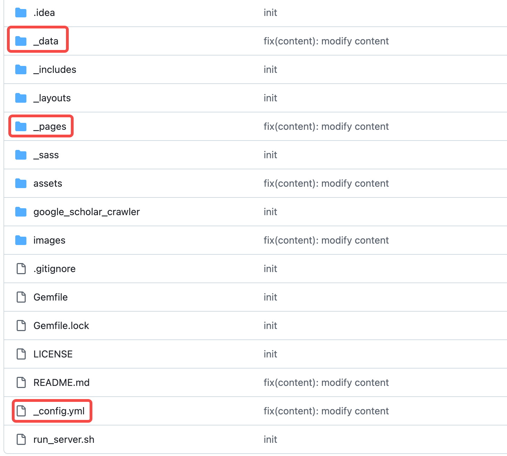
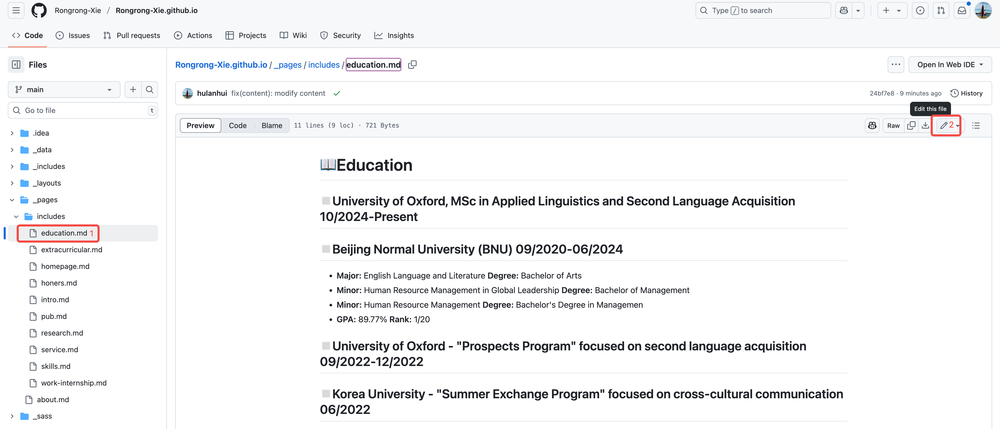
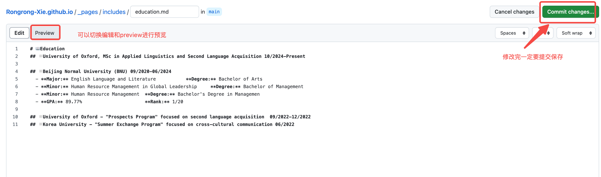

# 页面修改说明
```
├── _config.yml                # 左侧配置文件
├── _data/
│   └── navigation.yml         # 顶部导航菜单
├── _pages/                    # 页面主要内容
│   ├── about.md               # 主页，作用将各个子页面嵌入
│   └── includes/              # 主页各部分内容文件夹
│       ├── intro.md           # About Me 个人简介
│       ├── education.md       # 教育背景与培训
│       ├── pub.md             # Publications 发表论文
│       ├── presentations.md   # Presentations 学术报告/会议
│       ├── patents.md         # Patents 专利
│       ├── teaching.md        # Teaching 教学经历
│       ├── service.md         # Service 学术服务
│       ├── honers.md          # Honors & Awards 荣誉奖项
```
- 修改时主要关注几个页面：
    - 页面左侧内容在_config.yml中修改；
    - 头部菜单在navigation.yml修改；
    - 各个菜单的详情页在includes/下的页面；

> 直接在页面点击文件夹进去就能修改


