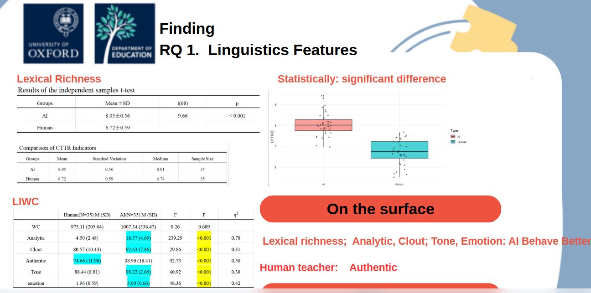
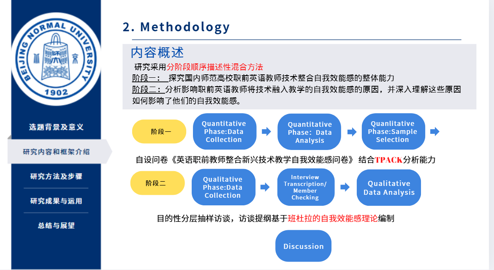

# 📝Publication and Conference Presentation

[**Factors influencing positive perceptions of hybrid teaching in higher education: a case study of an engineering university**](https://doi.org/10.1186/s41239-025-00521-5) | 2025 
Qiong L, **Rongrong X**, Minhui L
- Conducted a comprehensive literature review on hybrid teaching in engineering education.
- Developed a new theoretical framework guided by Bourdieu's fields and capital concepts to understand hybrid teaching contexts.
- Performed correlation analysis, multiple linear regression, and structural equation modeling to identify the key factors contributing to positive perceptions of hybrid teaching.
- Co-composed the discussion section, emphasizing the importance of constructing a novel Bourdieu-informed framework that explains socioeconomic factors influencing interactions within teaching and learning fields in higher engineering education.

**Enhancing EFL Conversations: A Comparative Study of AI and the Human Teacher.** | 2025 Paper presented at The 2025 Students’Ongoing Research in Educational Studies, University of Oxford 
**Rongrong X**
- Utilized a mixed-method design to analyze and compare participants' EFL conversation experiences with AI and the human teacher.
- Employed MANOVA to assess linguistic differences in the speaking conversations of AI and human teachers. 
- Examined language features such as lexical richness, social words, affective words,positive emotion words, negative emotion words, and words of assent.
- Used R for data processing and visualization.
- Conducted thematic analysis of interview transcripts and stimulated recall sessions. 
- Explored participants' perceptions of AI versus human instructors, focusing on language characteristic and interaction dynamics.

**Exploring Factors of Pre-service English Teachers’ Behavior Intention on AI in Training and Future Teaching.** | 2024 Presented at 1st XJTLU International Conference on Applied Linguistics in the AI Era （The best presentation award） 
**Rongrong, Xie**
- Utilized structural equation modeling (SEM) to validate an extended model combining the UTAUT and TPACK frameworks, referred to as the AI-TPACK model.
- Incorporated ethical considerations and perceived risks to reconstruct these established models.
- Proposed and empirically validated an integrated model highlighting individual beliefs, technological competence, and behavioral intention as core constructs. 
- Revealed that individual beliefs exert both direct and indirect (mediated by technological competence) positive effects on behavioral intention. 
- Demonstrated that technological competence also has a direct positive influence on behavioral intention.

**Pre-Service English Teachers’ Self-Efficacy in the Integration of Technology.** | 2023 Paper presented at The 2023 International Conference of Artificial Intelligence and Technology-Enhanced Language Learning. Shanghai 
**Rongrong, X**
- Employed a multiphase sequential descriptive mixed-method approach.
- **Phase 1:** Investigated the overall capacity of pre-service English teachers to integrate technology into teaching.
- **Phase 2:** Explored the reasons influencing pre-service teachers' self-efficacy in integrating technology and how these factors affect their self-efficacy.
- Pre-service English teachers' self-efficacy in integrating technology ranged from moderate to high. 
- Background factors such as gender, length of pre-service training, and place of upbringing showed no significant relationship with self-efficacy in technology integration. 
- Self-efficacy for applying technology was comparatively low, and considerable variability existed among participants regarding their confidence in presenting knowledge through technology. 
- Insufficient technological background knowledge and limited practical experience in integrating technology emerged as two primary reasons for low direct/indirect experience and reduced emotional engagement, ultimately leading to lower self-efficacy.

